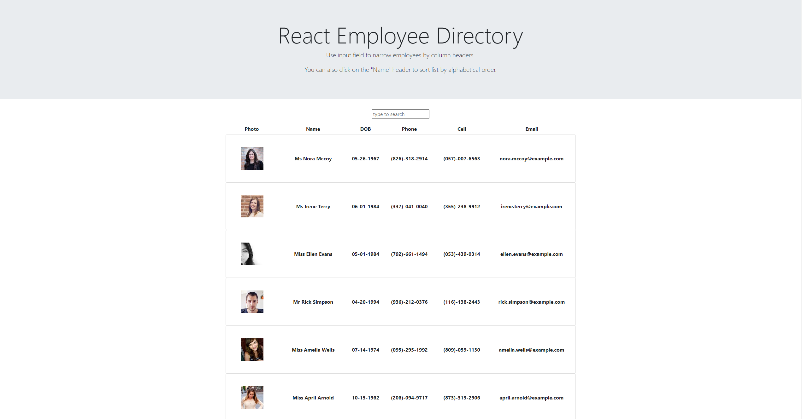

# React_Employee_Directory

## Description  

[App Link](https://jeashwor.github.io/react_employee_directory/)

A React based employee directory that allows a user to filter a list of employees based on column categories.  User can narrow down list using input field, in addition to sorting employ list alphabetically by there last name. 

* 

 
 
 

## Table of Contents  

* [Usage](#usage-instructions)  
* [License](#license)  
* [Questions](#questions)

 
 
 

## Usage Instructions

* 
* Application is hosted live using GitHub.  Use this [Link](https://jeashwor.github.io/react_employee_directory/) to try it out!
* Simply use the input field to type an attribute such as name, DOB, or phone number that you would like to filter the list by. 
* Note you can also sort the list by clicking on the "Name" header above the employee cards. Clicking a second time will reverse the order of the list. 

 
 
 

## License

* Application licensed under MIT.  For more information see [license document](./LICENSE).
  
 
 
 

## Questions

Check out my GitHub page here:  [jeashwor's Page](https://github.com/jeashwor)

If you have additional questions please email me at jeashwor@gmail.com